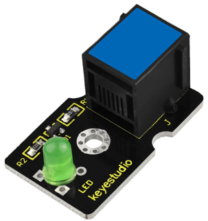
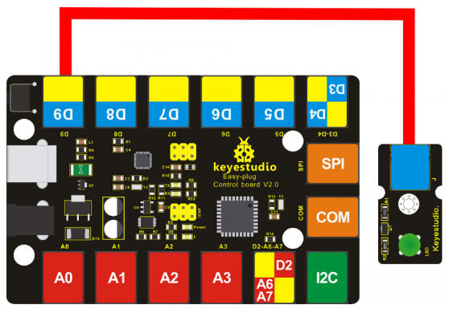
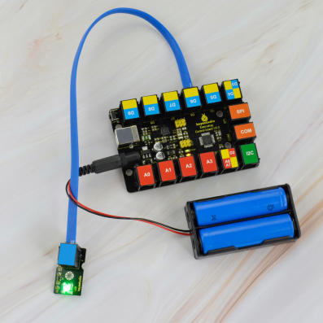

# KS0225 keyestudio EASY plug Green LED Module



## 1. Introduction

This is a special EASY plug green LED module. When connecting to ARDUINO, after programming, it can emit green light.

For easy use, the module’s 3pin are brought out as a crystal head socket. The socket is compatible with EASY plug Control board V2.0. You should connect the LED module to control board for communication using an RJ11 cable.

You can combine with other sensors to do various interactive experiments. You can also choose other LED modules to emit different light color like blue, red, yellow and white.

**Special Note:**

The sensor/module is equipped with the RJ11 6P6C interface, compatible with our keyestudio EASY plug Control Board with RJ11 6P6C interface.

If you have the control board of other brands, it is also equipped with the RJ11 6P6C interface but has different internal line sequence, can’t be used compatibly with our sensor/module.

## 2. Features

- Sensor type: Digital
- Working voltage: 5V
- LED color: green
- Easy to use
- Useful for light projects

## 3. Technical Details

- Dimensions: 34mm * 20mm * 18mm
- Weight: 3.8g

## 4. Connect It Up

Connect the EASY Plug LED module to control board using an RJ11 cable. Then connect the control board to your PC with a USB cable.



## 5. Upload the Code

Download code:  [Code](./Code.7z)

```c
int led = 9;

void setup()
{
	pinMode(led, OUTPUT);//Set Pin9 as output
}

void loop()
{
    digitalWrite(led, HIGH);//Turn led on
    delay(1000);
    digitalWrite(led, LOW);//Turn led off
    delay(1000);
}
```

## 6. Result

The LED will flash on for two seconds, then off for two seconds. If it doesn’t, make sure you have assembled the circuit correctly and verified and uploaded the code to your board. 

